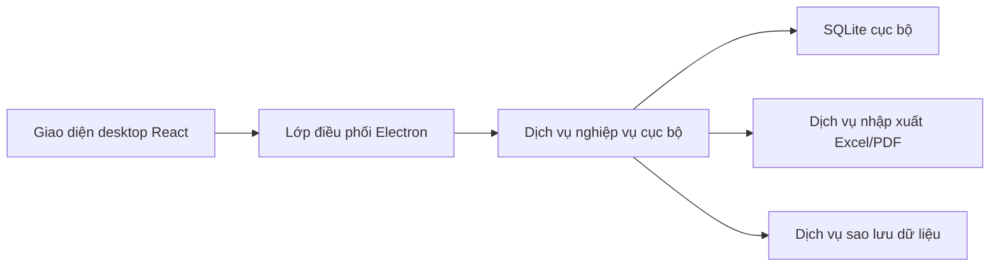
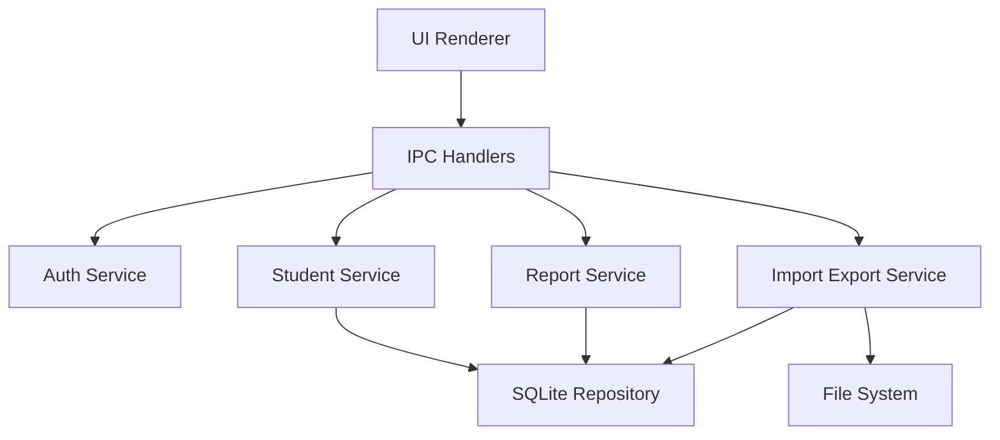
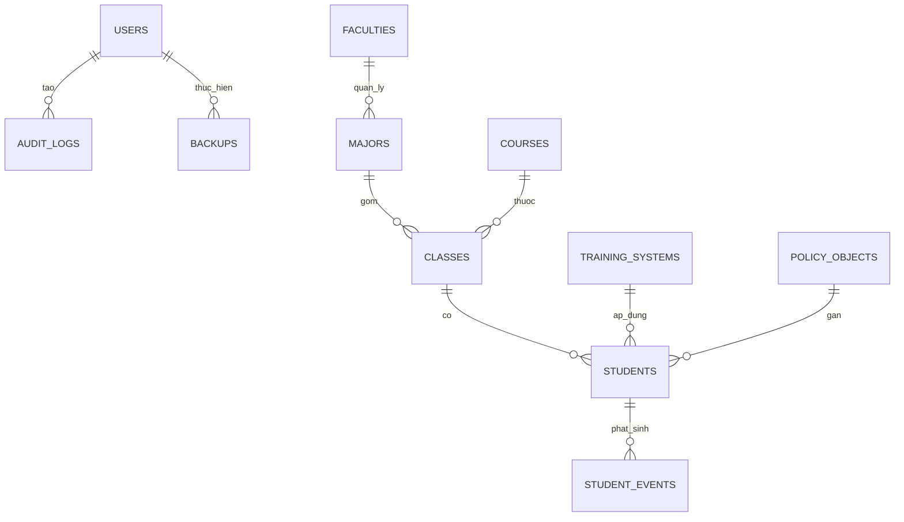

## 1. Thiết kế kiến trúc


Kiến trúc ưu tiên chạy cục bộ trên máy tính Windows để người dùng có thể tải xuống, cài đặt và sử dụng ngay trong mạng nội bộ hoặc offline. Ứng dụng tách rõ giao diện, lớp điều phối desktop và lớp nghiệp vụ dữ liệu để dễ mở rộng sang đồng bộ máy chủ ở giai đoạn sau nếu cần.

## 2. Mô tả công nghệ
- Frontend: React 18 + TypeScript + Vite + Tailwind CSS 3
- Desktop shell: Electron 31
- Điều hướng giao diện: React Router
- Quản lý trạng thái: Zustand
- Thành phần bảng và biểu mẫu: TanStack Table + React Hook Form + Zod
- Truy cập dữ liệu cục bộ: better-sqlite3 thông qua Electron main process
- Nhập xuất tệp: xlsx cho Excel, pdf-lib cho PDF
- Đóng gói ứng dụng: electron-builder để sinh file cài đặt Windows
- Kiểm thử trọng tâm: Vitest + Testing Library cho UI cốt lõi, smoke test cho luồng desktop

## 3. Định nghĩa route
| Route | Mục đích |
|-------|---------|
| /login | Màn hình đăng nhập nội bộ |
| /dashboard | Tổng quan số liệu và tác vụ nhanh |
| /students | Danh sách hồ sơ sinh viên |
| /students/:id | Chi tiết sinh viên và các tab nghiệp vụ |
| /search | Tìm kiếm và lọc nâng cao |
| /reports | Báo cáo, thống kê và xuất file |
| /settings/catalogs | Quản lý danh mục hệ thống |
| /settings/import-export | Nhập Excel, xuất Excel/PDF |
| /settings/admin | Người dùng, phân quyền, sao lưu và phục hồi |

## 4. Định nghĩa API nội bộ
Vì ứng dụng chạy desktop offline, giao tiếp dữ liệu dùng IPC giữa renderer process và main process thay cho HTTP API công khai.

```ts
type UserRole = "admin" | "affairs_officer" | "academic_officer";

type StudentStatus =
  | "dang_hoc"
  | "bao_luu"
  | "tam_ngung"
  | "tot_nghiep"
  | "thoi_hoc";

interface Student {
  id: string;
  studentCode: string;
  fullName: string;
  dateOfBirth: string;
  gender: "nam" | "nu" | "khac";
  phone?: string;
  email?: string;
  address?: string;
  facultyId: string;
  majorId: string;
  classId: string;
  courseId: string;
  trainingSystemId: string;
  status: StudentStatus;
  createdAt: string;
  updatedAt: string;
}

interface StudentEvent {
  id: string;
  studentId: string;
  type:
    | "hoc_bong"
    | "khen_thuong"
    | "ky_luat"
    | "vay_von"
    | "bien_dong"
    | "noi_ngoai_tru"
    | "lam_them"
    | "hoc_tap"
    | "ren_luyen"
    | "tot_nghiep";
  title: string;
  decisionNumber?: string;
  effectiveDate?: string;
  note?: string;
  metadataJson?: string;
}

interface SearchStudentInput {
  keyword?: string;
  classId?: string;
  courseId?: string;
  majorId?: string;
  trainingSystemId?: string;
  status?: StudentStatus;
  policyObjectId?: string;
  eventType?: StudentEvent["type"];
}
```

Các kênh IPC cốt lõi:
- `auth:login`: kiểm tra thông tin đăng nhập và tải vai trò người dùng.
- `students:list`, `students:create`, `students:update`, `students:getById`: thao tác hồ sơ sinh viên.
- `studentEvents:listByStudent`, `studentEvents:upsert`, `studentEvents:remove`: quản lý nghiệp vụ phát sinh.
- `search:students`: tìm kiếm nâng cao với nhiều tiêu chí.
- `reports:generate`: tạo dữ liệu báo cáo và xuất file.
- `import:studentsFromExcel`: nhập dữ liệu từ Excel kèm log lỗi.
- `backup:create`, `backup:restore`: sao lưu và phục hồi cơ sở dữ liệu.

## 5. Sơ đồ kiến trúc ứng dụng


## 6. Mô hình dữ liệu
### 6.1 Sơ đồ dữ liệu


### 6.2 Định nghĩa dữ liệu
```sql
CREATE TABLE users (
  id TEXT PRIMARY KEY,
  username TEXT NOT NULL UNIQUE,
  password_hash TEXT NOT NULL,
  full_name TEXT NOT NULL,
  role TEXT NOT NULL,
  is_active INTEGER NOT NULL DEFAULT 1,
  created_at TEXT NOT NULL,
  updated_at TEXT NOT NULL
);

CREATE TABLE faculties (
  id TEXT PRIMARY KEY,
  name TEXT NOT NULL UNIQUE
);

CREATE TABLE majors (
  id TEXT PRIMARY KEY,
  faculty_id TEXT NOT NULL,
  name TEXT NOT NULL,
  FOREIGN KEY (faculty_id) REFERENCES faculties(id)
);

CREATE TABLE courses (
  id TEXT PRIMARY KEY,
  code TEXT NOT NULL UNIQUE,
  name TEXT NOT NULL,
  start_year INTEGER NOT NULL
);

CREATE TABLE classes (
  id TEXT PRIMARY KEY,
  major_id TEXT NOT NULL,
  course_id TEXT NOT NULL,
  code TEXT NOT NULL UNIQUE,
  name TEXT NOT NULL,
  FOREIGN KEY (major_id) REFERENCES majors(id),
  FOREIGN KEY (course_id) REFERENCES courses(id)
);

CREATE TABLE training_systems (
  id TEXT PRIMARY KEY,
  name TEXT NOT NULL UNIQUE
);

CREATE TABLE policy_objects (
  id TEXT PRIMARY KEY,
  name TEXT NOT NULL UNIQUE
);

CREATE TABLE students (
  id TEXT PRIMARY KEY,
  student_code TEXT NOT NULL UNIQUE,
  full_name TEXT NOT NULL,
  date_of_birth TEXT,
  gender TEXT,
  phone TEXT,
  email TEXT,
  address TEXT,
  faculty_id TEXT NOT NULL,
  major_id TEXT NOT NULL,
  class_id TEXT NOT NULL,
  course_id TEXT NOT NULL,
  training_system_id TEXT NOT NULL,
  policy_object_id TEXT,
  status TEXT NOT NULL,
  created_at TEXT NOT NULL,
  updated_at TEXT NOT NULL,
  FOREIGN KEY (faculty_id) REFERENCES faculties(id),
  FOREIGN KEY (major_id) REFERENCES majors(id),
  FOREIGN KEY (class_id) REFERENCES classes(id),
  FOREIGN KEY (course_id) REFERENCES courses(id),
  FOREIGN KEY (training_system_id) REFERENCES training_systems(id),
  FOREIGN KEY (policy_object_id) REFERENCES policy_objects(id)
);

CREATE TABLE student_events (
  id TEXT PRIMARY KEY,
  student_id TEXT NOT NULL,
  type TEXT NOT NULL,
  title TEXT NOT NULL,
  decision_number TEXT,
  effective_date TEXT,
  note TEXT,
  metadata_json TEXT,
  created_at TEXT NOT NULL,
  updated_at TEXT NOT NULL,
  FOREIGN KEY (student_id) REFERENCES students(id)
);

CREATE TABLE backups (
  id TEXT PRIMARY KEY,
  file_path TEXT NOT NULL,
  created_by TEXT NOT NULL,
  created_at TEXT NOT NULL,
  FOREIGN KEY (created_by) REFERENCES users(id)
);

CREATE TABLE audit_logs (
  id TEXT PRIMARY KEY,
  user_id TEXT NOT NULL,
  action TEXT NOT NULL,
  target_type TEXT NOT NULL,
  target_id TEXT,
  created_at TEXT NOT NULL,
  FOREIGN KEY (user_id) REFERENCES users(id)
);

CREATE INDEX idx_students_code ON students(student_code);
CREATE INDEX idx_students_class ON students(class_id);
CREATE INDEX idx_students_course ON students(course_id);
CREATE INDEX idx_student_events_student ON student_events(student_id);
CREATE INDEX idx_student_events_type ON student_events(type);
```
