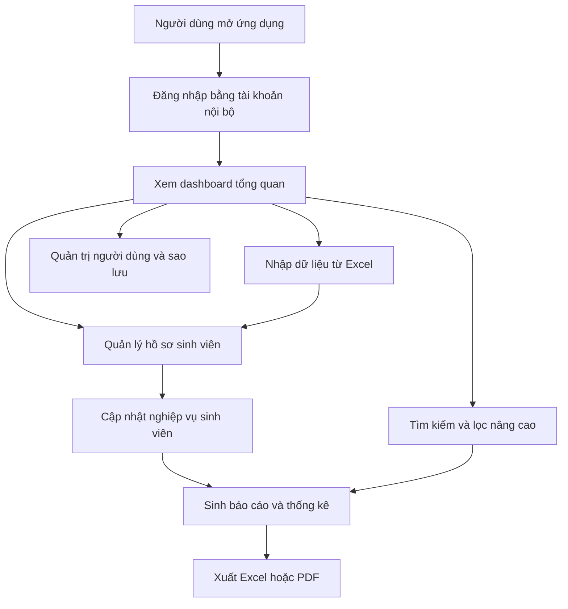

## 1. Tổng quan sản phẩm
Ứng dụng quản lý sinh viên là phần mềm desktop cài trên Windows, cho phép nhà trường lưu trữ hồ sơ sinh viên tập trung, tra cứu nhanh, cập nhật biến động và xuất báo cáo nghiệp vụ.
- Sản phẩm phục vụ phòng công tác sinh viên, phòng đào tạo và cán bộ quản trị cần một công cụ chạy ổn định, có thể dùng offline, dễ sao lưu và dễ triển khai nội bộ.
- Giá trị cốt lõi là giảm thao tác thủ công trên Excel rời rạc, chuẩn hóa hồ sơ sinh viên theo từng khóa/lớp/ngành và hỗ trợ báo cáo nhanh cho nhà trường.

## 2. Tính năng cốt lõi

### 2.1 Vai trò người dùng
| Vai trò | Phương thức đăng nhập | Quyền cốt lõi |
|------|---------------------|------------------|
| Quản trị hệ thống | Tài khoản nội bộ | Quản lý người dùng, phân quyền, danh mục, sao lưu và phục hồi dữ liệu |
| Cán bộ công tác sinh viên | Tài khoản nội bộ | Quản lý hồ sơ sinh viên, học bổng, khen thưởng, kỷ luật, biến động, nội ngoại trú |
| Cán bộ đào tạo | Tài khoản nội bộ | Theo dõi học tập, rèn luyện, tốt nghiệp, tìm kiếm và xuất báo cáo |

### 2.2 Mô-đun chức năng
1. **Đăng nhập và tổng quan**: đăng nhập nội bộ, thống kê nhanh số lượng sinh viên, cảnh báo hồ sơ thiếu và hoạt động gần đây.
2. **Hồ sơ sinh viên**: danh sách sinh viên, hồ sơ chi tiết, thông tin cá nhân, lớp, khóa, ngành, hệ đào tạo, trạng thái học tập.
3. **Nghiệp vụ sinh viên**: học bổng, khen thưởng, kỷ luật, vay vốn, biến động, nội trú/ngoại trú, làm thêm, kết quả học tập, rèn luyện, tốt nghiệp.
4. **Tìm kiếm và lọc nâng cao**: tìm kiếm theo nhiều tiêu chí, lưu bộ lọc nhanh, xuất danh sách kết quả.
5. **Báo cáo và thống kê**: báo cáo theo lớp, khóa, ngành, đối tượng chính sách, học bổng, kỷ luật, tốt nghiệp và biến động.
6. **Hệ thống và dữ liệu**: quản lý danh mục, nhập Excel, xuất Excel/PDF, sao lưu dữ liệu, phục hồi dữ liệu, quản lý tài khoản và phân quyền.

### 2.3 Chi tiết màn hình
| Tên màn hình | Mô-đun | Mô tả tính năng |
|-----------|-------------|---------------------|
| Đăng nhập | Xác thực nội bộ | Nhập tên đăng nhập và mật khẩu, ghi nhớ phiên, hiển thị lỗi đăng nhập và trạng thái hệ thống |
| Tổng quan | Dashboard | Hiển thị số lượng sinh viên theo trạng thái, biểu đồ theo khóa/ngành, tác vụ nhanh và danh sách hồ sơ cần bổ sung |
| Hồ sơ sinh viên | Danh sách và chi tiết | Tạo, sửa, xóa mềm, xem hồ sơ đầy đủ, ảnh đại diện, thông tin liên hệ, học vụ và lịch sử thay đổi |
| Nghiệp vụ sinh viên | Tab nghiệp vụ | Quản lý học bổng, khen thưởng, kỷ luật, vay vốn, biến động, nội ngoại trú, làm thêm, học tập, rèn luyện, tốt nghiệp theo từng sinh viên |
| Tìm kiếm nâng cao | Bộ lọc nhiều điều kiện | Lọc theo mã sinh viên, họ tên, lớp, khóa, ngành, hệ đào tạo, hộ khẩu, diện chính sách, học bổng, kỷ luật, biến động và xuất kết quả |
| Báo cáo | Thống kê và in ấn | Tạo báo cáo theo mẫu, xem trước, xuất Excel/PDF, thống kê theo lớp hoặc toàn trường |
| Danh mục hệ thống | Cấu hình dữ liệu chuẩn | Quản lý khóa học, ngành, lớp, hệ đào tạo, loại học bổng, loại biến động, hành vi vi phạm, xếp loại và thông tin trường |
| Nhập xuất dữ liệu | Import/Export | Nhập danh sách sinh viên từ Excel, kiểm tra lỗi cột, xem log import, xuất dữ liệu và tải mẫu file |
| Quản trị hệ thống | Người dùng và sao lưu | Tạo tài khoản, phân quyền theo vai trò, sao lưu cơ sở dữ liệu, phục hồi bản sao lưu và nhật ký thao tác |

## 3. Luồng nghiệp vụ cốt lõi
Người dùng đăng nhập vào ứng dụng desktop, vào dashboard để xem tổng quan, sau đó thao tác trên hồ sơ sinh viên hoặc nhập dữ liệu hàng loạt từ Excel. Dữ liệu phát sinh như học bổng, kỷ luật, rèn luyện, biến động sẽ được gắn vào từng sinh viên và dùng lại cho phần tìm kiếm, thống kê, báo cáo. Quản trị viên chịu trách nhiệm phân quyền, sao lưu và phục hồi dữ liệu khi cần.

## 4. Thiết kế giao diện
### 4.1 Phong cách thiết kế
- Tông màu chủ đạo: xanh navy đậm, trắng ngà và xám đá để tạo cảm giác nghiệp vụ, tin cậy và hiện đại.
- Màu nhấn: xanh ngọc và cam hổ phách để phân biệt trạng thái, cảnh báo và số liệu quan trọng.
- Nút bấm: bo góc vừa phải, bóng nhẹ, trạng thái hover rõ ràng, ưu tiên kích thước lớn cho tác vụ thường dùng.
- Chữ: tiêu đề dùng font hiển thị chắc khỏe; nội dung dùng font sans dễ đọc, ưu tiên tối ưu cho màn hình desktop nhiều dữ liệu.
- Bố cục: desktop-first với sidebar cố định, top bar nhẹ, vùng nội dung chia thẻ, bảng dữ liệu lớn và panel chi tiết.
- Biểu tượng: dùng icon nét mảnh đồng bộ, dễ nhận diện cho từng nghiệp vụ như hồ sơ, học bổng, báo cáo, sao lưu.

### 4.2 Tổng quan thiết kế màn hình
| Tên màn hình | Mô-đun | Thành phần UI |
|-----------|-------------|-------------|
| Đăng nhập | Form xác thực | Khối trung tâm nổi bật, nền chuyển sắc nhẹ, trường nhập lớn, thông báo lỗi rõ ràng |
| Tổng quan | Thẻ thống kê | Các thẻ KPI, biểu đồ cột/tròn, panel công việc gần đây, thanh tác vụ nhanh |
| Hồ sơ sinh viên | Bảng dữ liệu | Bảng sticky header, bộ lọc trên cùng, ngăn xem chi tiết bên phải, tab hồ sơ và nghiệp vụ |
| Nghiệp vụ sinh viên | Biểu mẫu nhiều phần | Form theo nhóm dữ liệu, timeline lịch sử, badge trạng thái, modal nhập nhanh |
| Tìm kiếm nâng cao | Bộ lọc thông minh | Panel bộ lọc trái, bảng kết quả phải, chip điều kiện, nút lưu mẫu tìm kiếm |
| Báo cáo | Xem trước báo cáo | Bộ chọn loại báo cáo, tham số thời gian/lớp, khung xem trước, nút xuất file |
| Danh mục hệ thống | Danh sách cấu hình | Bảng danh mục, form thêm/sửa inline, khu vực mô tả và ràng buộc |
| Nhập xuất dữ liệu | Wizard import | Bước tải file, map cột, kiểm tra lỗi, xác nhận nhập, hiển thị log |
| Quản trị hệ thống | Quản lý bảo trì | Bảng người dùng, switch phân quyền, khu vực sao lưu/phục hồi và lịch sử thao tác |

### 4.3 Responsive
Ứng dụng ưu tiên desktop-first cho màn hình từ 1280px trở lên, hỗ trợ co giãn hợp lý cho laptop 1024px và có hành vi thích nghi cơ bản trên tablet. Các bảng dữ liệu giữ khả năng cuộn ngang, thanh tác vụ quan trọng luôn hiển thị và vùng form tối ưu cho thao tác chuột lẫn bàn phím.
